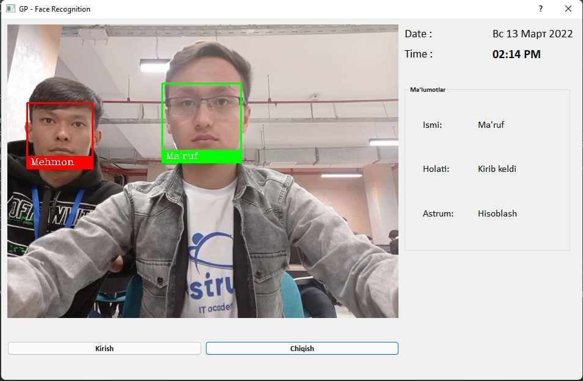

## Face-recognition
### "iFace" - name of attendance project for Astrum. This project was created by the GP. 

**Aim of the project**
- To automate timings(entering-exiting) of students in Atrum IT academy
- To see people who are in Academy with real-time app (Full-stack website) 
- To maximize mentors focus on students
- To attract students to Academy

### You can a prototype of the project here:

- Also we have uzbek speaking assistant for guests in order to speak to them while they are bored

*For more information, I have uploaded* **idea.pptx** *file*